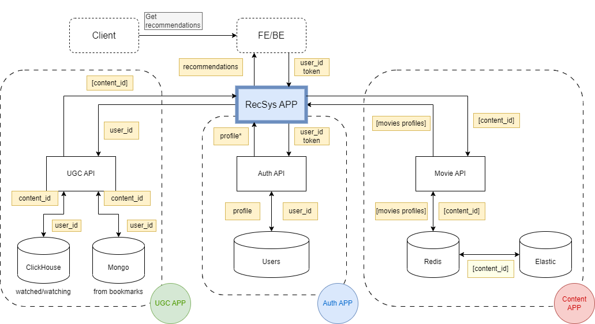
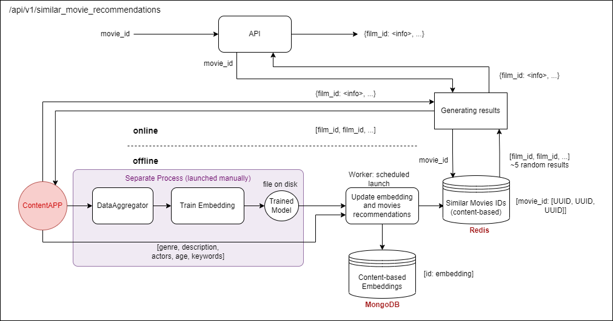
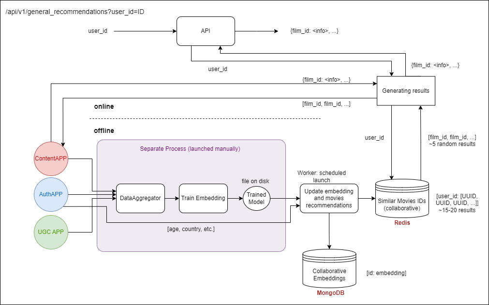

# Graduation Project: Recommender System

___________________________

Repository: https://github.com/dmshirochenko/online_cinema

<!-- toc -->
 
- [About](#about)
- [Architecture](#architecture)
  - [High-level Design](#high-level-design-and-communications-with-another-apis)
  - [Content-based Recommendations](#content-based-recommendations)
  - [Collaborative Recommendations](#collaborative-recommendations)
- [Getting Started](#getting-started)
- [The Team](#the-team)

<!-- tocstop -->

___________________________

## About
Recommender system developed as a part of Online Cinema allows 
customers to get movies recommendations based on their personal preferences and experience.

## Architecture
It connects with several services (applications) which act as data sources:
* **Authorization Service** provides authentication and authorization functionality 
* **Content Service** provides information about movies stored in databases
* **UGC Service** provides information about users activities such as likes/dislikes, bookmarked movies, etc.

### Blueprints
Schemes in C4-PlantUML format are presented for this project. 
Describe Levels from 1 (System level) to 3 (Components Level) [here](docs/images/c4-puml).

#### High-Level design and communications with another APIs
Recommender System application interacts with Web Application (FE/BE) 
which generates queries to get personal movies recommendations.



#### Content-based recommendations
To generate content-based recommendations system uses information about films from Content service 
and information about film which is user's just watched.

ML component includes modules of data aggregation, model training 
and provides scripts to get inference for saving resulted embeddings in storage.
It runs in a background, launched manually with specified period.
Model's saved on disk.



#### Collaborative recommendations
Combine data from different data sources making resulted recommendations more personalized.



## Getting Started
Each of services includes README where described specify information and details of installation.

* [Auth service](auth/README.md)
* [Content service](content-service/README.md)
* [Recommender system service](rec-sys-service/api/ReadMe.md)
* [UGC service](ugc-service/README.md)
* [ML content-based](rec-sys-service/similar_recs/readme.md)

To run all applications as one system [Makefile](Makefile) can be used.
```
make start
```

To close all applications
```
make down
```